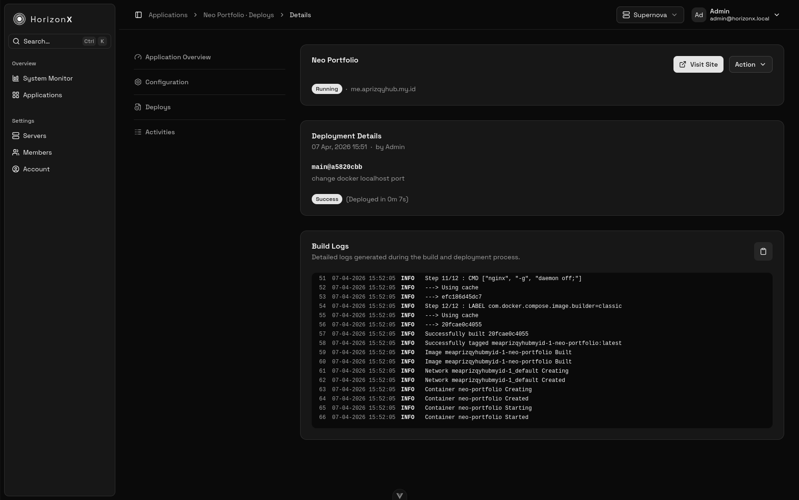
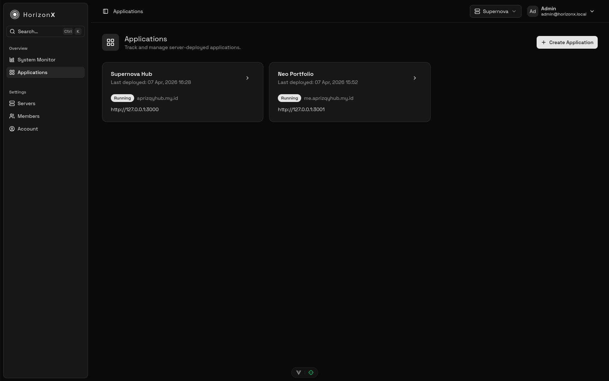
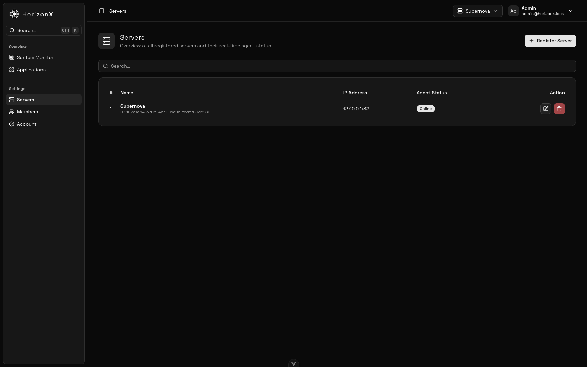

# HorizonX Dashboard

HorizonX Dashboard is the Vue 3 + Vite console for operating the HorizonX platform. It combines real-time server telemetry, application lifecycle controls, access management, and account settings inside a single-page experience that talks to the HorizonX HTTP and WebSocket APIs.

<table>
  <tr>
    <td></td>
    <td></td>
  </tr>
</table>

<table>
  <tr>
    <td></td>
    <td></td>
    <td></td>
  </tr>
</table>

> **Note**: This repository contains the **Frontend** code.  
> The **Backend Server** can be found here: [https://github.com/zlnew/horizonx](https://github.com/zlnew/horizonx)

## Key highlights

- **System-wide visibility** – the System Monitor shows uptime, storage, network, and resource stats pulled via `/api/servers/*/metrics/latest` plus server status pushed through `/api/ws/user` subscriptions.
- **Application lifecycle** – list, create, configure, deploy, and inspect deployment/activity jobs for each application. Dedicated pages cover overview, configuration, deploy history, and job logs with contextual permission checks.
- **Team & account management** – the Members page drives CRUD flows for users (via dialogs), while the Account page lets the signed-in user update their profile and password. Permissions are enforced through Pinia stores and reused constants such as `permission.ts` and `application-status.ts`.
- **Productivity niceties** – breadcrumbs, server selector, global `Ctrl+K` search, toast notifications (`vue-sonner`), loading and dialog layers, and `AppHeader`/`AppSidebar` layouts keep navigation consistent.
- **Resilient networking** – `src/composables/fetch.ts` centralizes cookie-based sessions, CSRF headers, and 401/403 handling; `src/composables/web-socket.ts` manages a `/api/ws/user` connection with reconnection, resubscription, and idle/visibility hooks.
- **PWA-ready** – `vite-plugin-pwa` plus `registerServiceWorker.ts` automatically registers a service worker, refreshes content hourly, and surfaces offline/update toast prompts.

## Architecture & folders

- `src/main.ts` bootstraps Vue 3, Pinia, Vue Router, the global CSS, sonner toasts, and the service worker registration.
- `src/router` defines the auth routes, server-selection flow, and the nested `MainLayout` stack for applications, servers, metrics, members, and account pages.
- `src/layouts` + `src/components` hold reusable UI pieces (sidebar, header, dialogs, cards, tables, data loaders, badges, search command dialog, etc.) built with Reka UI components, Tailwind CSS v4, and custom theming in `src/main.css`.
- `src/stores` (Pinia) encapsulate auth, app state, applications, deployments/env/jobs, servers, metrics, loading, and user data.
- `src/api` introduces typed wrappers around `/api` endpoints (`Auth`, `Applications`, `Servers`, `Users`, `Account`, `Jobs`, `Logs`, etc.) built on top of the shared `Api` base.
- `src/composables` provide helpers for page metadata, date/number formatting, dialogs, and WebSocket lifecycle management.

## Tech stack

- Vue 3 + `<script setup>` & Composition API
- Vite (rolldown-vite) with TypeScript and Vue plugins
- Pinia for state management, Vue Router for navigation
- Reka UI toolkit, Tailwind CSS, tw-animate-css, class-variance-authority, lucide icons
- VeeValidate + Zod for forms, TanStack Table + Unovis for tables/charts
- VueUse core utilities and vue-sonner toasts
- vite-plugin-pwa for offline/updates and `virtual:pwa-register`
- Vitest, ESLint, Prettier (with sorted imports) for quality checks

## Prerequisites

- Node.js ^20.19.0 or >=22.12.0 (matching `package.json` engines)
- npm 10+ (for the bundled scripts)

## Getting started

```bash
npm install
npm run dev
```

Visit `http://localhost:5173` (or the URL Vite reports). The SPA performs a `/api/health` check, initializes cookies, and starts the `/api/ws/user` handshake as soon as `App.vue` mounts.

## Useful scripts

- `npm run dev` – start Vite dev server with hot reload
- `npm run build` – run `vue-tsc` type-checking and `vite build`
- `npm run build:production` – Vite build in production mode
- `npm run build-only` – skip the type-checker, just build
- `npm run preview` – preview the production build locally
- `npm run test:unit` – run Vitest unit suites
- `npm run lint` – ESLint with auto-fix cache
- `npm run format` – Prettier with Tailwind sorting
- `npm run type-check` – run `vue-tsc --build` separately

## Testing & quality

- Forms use `vee-validate` + Zod schemas (e.g., `AccountPage`, `LoginPage`).
- API responses are normalized in `src/api/Api.ts` and surfaced via stores.
- Vitest is configured via `vitest.config.ts`; add spec files under `src/**/__tests__` as needed.

## Production notes

- Ensure the backend serves the compiled assets (default `dist`).
- Keep the health endpoint `/api/health` and CSRF cookies available so the app can refresh tokens when a 403 occurs.
- The service worker checks for updates every hour and notifies users via a toast (see `registerServiceWorker.ts`).
- The UI disables the WebSocket when the tab is idle/hidden (VueUse `useIdle`/`useDocumentVisibility`) and reconnects automatically when visible.

## Customization pointers

- Update `src/composables/app.ts` to change the sidebar menu or WebSocket URL.
- Leverage `src/constants/permission.ts` and `application-status.ts` when enforcing new permission guards.
- Add new API clients under `src/api` and propagate them through related stores.
- Use `src/components/ui/*` building blocks for consistent styling with Reka UI.

## Troubleshooting

- If you get redirected to `/auth/login`, confirm the backend sets the session cookies and `csrf_token`. The UI automatically reloads after a 403 by refreshing `/api/health`.
- Switching servers forces `window.location.reload()` so the new context, metrics, and application lists are re-fetched.
- WebSocket errors (e.g., handshake issues) and CSRF failures are logged to the console with hints from `src/composables/web-socket.ts` and `src/composables/fetch.ts`.
