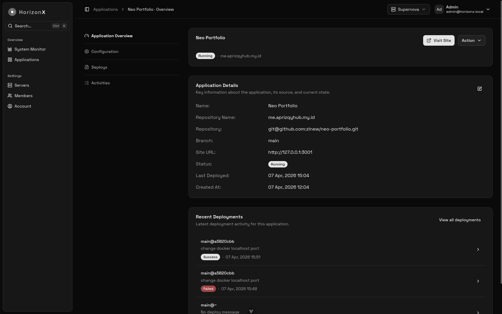
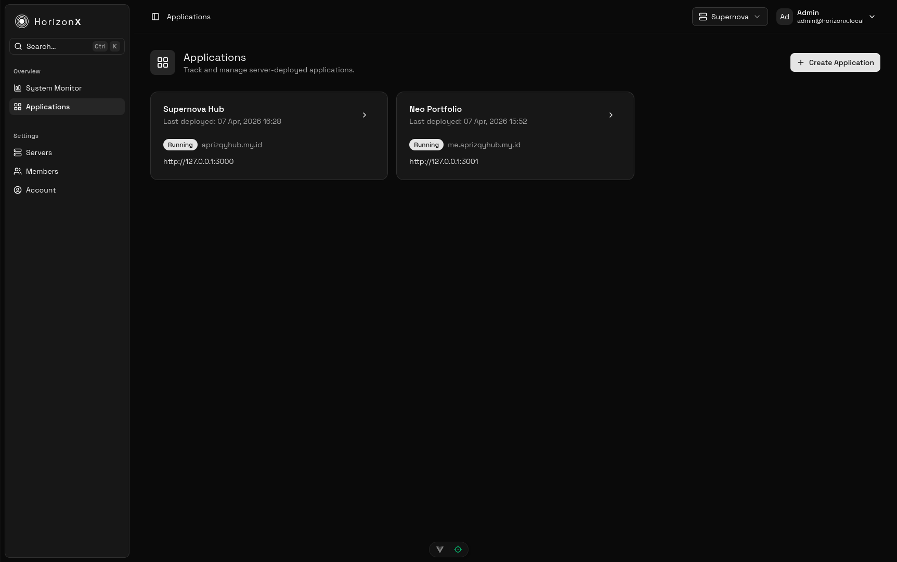
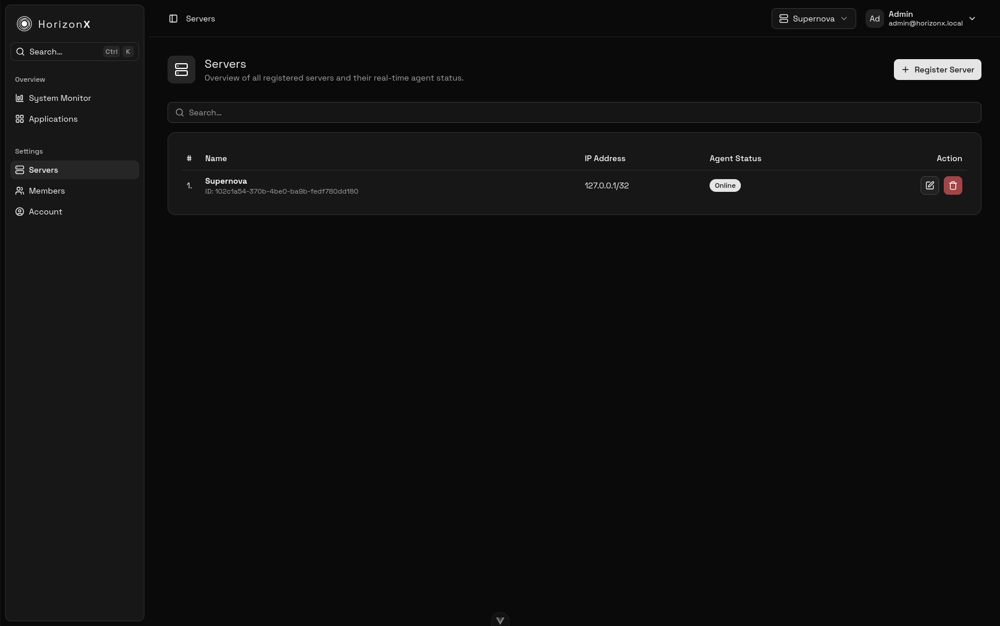

# HorizonX Dashboard

**The command center for your apps and servers.**

HorizonX Dashboard is the Vue 3 console for the HorizonX platform. It's where you see what's running, deploy new versions, roll back bad ones, and check on every box — without touching a terminal.

> **Note**: This repository contains the **Frontend** code.
> The **Backend Server** (Go control plane + agent) lives here: [https://github.com/zlnew/horizonx](https://github.com/zlnew/horizonx)

<table>
  <tr>
    <td></td>
    <td></td>
  </tr>
</table>

<table>
  <tr>
    <td></td>
    <td></td>
    <td></td>
  </tr>
</table>

---

## Why this dashboard?

The HorizonX server (API + agents) is the engine; this is the steering wheel. Instead of SSH-ing into boxes to check CPU, or running `docker compose up` by hand, you get:

- **One view of everything** — live server telemetry (CPU, RAM, disk, network) and app status side by side.
- **Deploy from a button** — point at a git branch, hit Deploy; watch the job logs as the agent builds and health-gates the rollout.
- **Rollback in one click** — every deployment is recorded; replay any previous image tag.
- **Manage the whole fleet** — servers, applications, members, and permissions without touching config files.

The UI talks to the HorizonX HTTP + WebSocket APIs: cookie-based sessions, CSRF handling, and a resilient `/api/ws/user` connection with automatic reconnection.

---

## Quick start (development)

```bash
npm install
npm run dev
```

Visit `http://localhost:5173` (or the URL Vite reports). The SPA checks `/api/health`, initializes cookies, and starts the WebSocket handshake on mount — so point it at a running [HorizonX server](https://github.com/zlnew/horizonx) first (default proxy: `localhost:3000`).

## Production build

```bash
npm run build        # vue-tsc type-check + vite build → dist/
```

The built SPA is served by nginx (see `Dockerfile` / `docker-compose.prod.yml`), which proxies `/api/*` and WebSocket traffic to the control plane.

---

## Tech stack

- Vue 3 + `<script setup>` & Composition API
- Vite (rolldown-vite) + TypeScript
- Pinia (state), Vue Router (navigation)
- Reka UI, Tailwind CSS v4, lucide icons
- VeeValidate + Zod (forms), TanStack Table + Unovis (tables/charts)
- VueUse, vue-sonner toasts, vite-plugin-pwa (offline/updates)
- Vitest, ESLint, Prettier

## Useful scripts

- `npm run dev` – Vite dev server with hot reload
- `npm run build` – type-check + production build
- `npm run test:unit` – Vitest unit suites
- `npm run lint` / `npm run format` – ESLint / Prettier
- `npm run type-check` – `vue-tsc` only

## Architecture

- `src/api` — typed wrappers around `/api` endpoints (Auth, Applications, Servers, Users, Jobs, Logs…)
- `src/stores` — Pinia stores for auth, apps, deployments, servers, metrics, users
- `src/composables` — shared logic: `fetch.ts` (session/CSRF/401-403 handling), `web-socket.ts` (WS lifecycle + reconnect), dialogs, formatting
- `src/router` + `src/layouts` — auth flow, server selection, and the main `MainLayout` stack
- `src/components/ui` — reusable Reka UI building blocks (dialogs, cards, tables, badges, search)

## Troubleshooting

- Redirected to `/auth/login`? Confirm the backend sets session cookies + `csrf_token`; the UI refreshes `/api/health` after a 403.
- WebSocket handshake issues? Check the backend `ALLOWED_ORIGINS` and that `/api/ws/user` is reachable (server:3000 in dev).
- Switching servers forces a `window.location.reload()` so metrics and app lists re-fetch in the new context.
